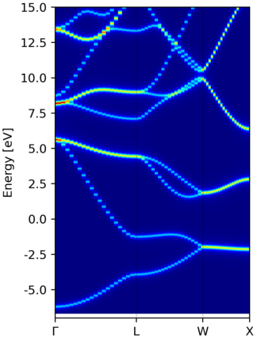
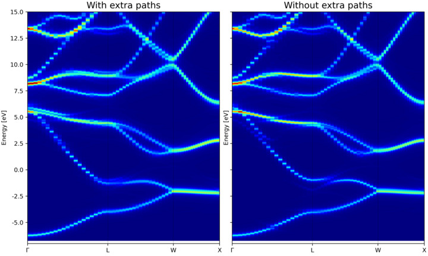
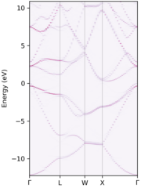

# easyunfold

This package is intended for obtaining the effective band structure of a supercell for a certain path of the primitive cell.
It was originally based on [PyVaspwfc](https://github.com/QijingZheng/Vaspeasyunfolding) for reading wavefunction output of VASP, and contains some code of the latter.
An notable improvement is that breaking symmetry is taken accounted of by sampling additional kpoints and taking average accordingly, which was previously missing.
Our goal is to make the unfolding process easier to caryy out and less likely to go wrong.

For the methodology, see: https://link.aps.org/doi/10.1103/PhysRevB.85.085201

NOTE: This package is under a MIT license, although the original PyVaspwfc code does not specific a license.

## Installation

At the moment, the package should be installed from the git repository.
A recently version of `pip` is needed to do this, due to the use of new style `pyproject.toml` configuration file.
To upgrade your `pip`, do:

```
pip install -U pip
```

Assuming the package is in the `easyunfold` folder, use the following command to install:

```
pip install ./easyunfold
```

After installation, run `easyunfold` should give the following output:

```
Usage: easyunfold [OPTIONS] COMMAND [ARGS]...

  Tool for performing band unfolding

Options:
  --help  Show this message and exit.

Commands:
  generate  Generate the kpoints for sampling the supercell
  unfold    Perform unfolding and plotting
```

## Usage

Main goal of this tool is to make the unfolding process easier.
To generate a unfolded band structure, one typically needs to perform the following step:

1. Create a primitive cell, and generate a k point path for this primitive cell.
2. Create a supercell, and obtain its optimised structure.
3. Generate a series of kpoints in the supercell to be calculated.
4. Perform a band structure calculation using the supercell, and save its wave function.
5. Run post-processing to obtain the unfolded band structure.

The supercell usually contains certain defects, or a special quasi random structure.
In both cases, its symmetry is lowered when compared to the perfect primitive cell.
Hence, for a given kpoint path in the primitive cell, additional kpoints may need to be sampled, and the extracted spectral weights need to be averaged in the end to obtained the effective band structure (EBS).

At the moment, only VASP calculations are supported, although in principle other PW code can be supported easily if the wavefunction can be read in.
Use of VASP is assumed for the guide below.

### Step 1 - Generate the kpoints path of the primitive cell

This can be done by well established packages such as [seekpath](https://www.materialscloud.org/work/tools/seekpath).
Be careful that the "standardised" primitive cell may be different from input structure,
and the generated path is correct for the standard primitive cell only.
We recommand using [sumo](https://github.com/SMTG-UCL/sumo) for generating the kpoints, which provides a nice command line interface:

```
sumo-kgen -p POSCAR
```

Care should be taken if one uses the initial structure for further supercell generation, do verify that the lattice parameters are identical between the two.
A `POSCAR_prim` file will be written out if `sumo` think the primitive cell is different from the input structure.
The kpoints along the path is written to `KPOINTS_band`.

### Step 2 - Generate the kpoints to be used for the supercell calculation

At this point, you should have your relaxed supercell structure (which may have a lower symmetry).
The set of kpoints for the supercell band structure can be generated with:

```
easyunfold generate primitive/POSCAR supercell/POSCAR primitive/KPOINTS_band --matrix "2 2 2"
```

Note that the `--matrix` input is for setting the transformation matrix such that

```
cell_super = M @ cell_primitive
```

where `cell_super` and `cell_primitive` are (3,3) matrix made of row lattice vectors.
If `M` is non-diagonal, all nine elements must be passed in a row-major order.

It is possible to omit `--matrix`` if the supercell is perfectly commensurate with the primitive cell.
This can be the case if the supercell calculation did not undergo cell relaxation.

If cell relaxation did take place, it is important to note that the unfolded band structure is not for exact  original primitive cell, but for a primitive cell deformed in a similar way as the supercell.

A `easyunfold.json` file will be written which contains the information of the unfolding.
The kpoints needed to be calculated for the supercell is written to a file named `KPOINTS_easyunfold`.
It is possible to change the name `easyunfold` by passing a explicit tag with the command line `--out-file`.

TODO: add function to do one-step generation of zero-weighted `KPOINTS` for hybrid functional. At the moment, you will have to concatenate the `KPOINTS` file and edit the weight manually.

TODO: add support for split-kpoint calculations.

### Step 3 - Perform the unfolding

At this point, a supercell calculation should be completed with a `WAVECAR` written containing all of the kpoints in the `KPOINTS_easyunfold` file generated.
This is typically a non self-consistent calculation with `ICHARG=11` for standard DFT, or a self-consistent calculation with zero-weighted kpoints if hybrid functional is used.

To compute the spectral weights, run the following command:

```
easyunfold unfold calculate WAVECAR
```

This command compute the spectral weight and save them into the  `easyunfold.json` file.
You can load the `easyunfold.json` file to read the spectral weights manually, or proceed with the command lien interface to generate a plot.

### Step 4 - Plot the results

Simply do:

```
easyunfold unfold plot
```

to generate a plot of the spectral function.
It is possible to further customise the plot though command line arguments.

### Hints

The `easyunfold.json` file saves the settings as the computed spectral weights.
There is a `easyunfold unfold status` command to show the information stored in this file.
Once the spectral weights are stored, you can delete the `WAVECAR` file to save space.
You may want to do the unfold calculation on the remote machine directly, then copy the `easyunfold.json` back to your local machine for plotting and further analysis.

## Example

Si 222 supercell with one displaced atom: [here](https://github.com/SMTG-UCL/easyunfold/blob/master/examples/Si222/README.md).

## Effect of symmetry breaking and sampling additional kpoints

Test case - Si 2x2x2 cell.
The first atom is displaced by 0.2 A in the `[111]` direction.
This reduce the number of symmetry operations from 48 to 6.
Hence, additional kpoints need to be sampled for the pathway generated assuming a perfect primitive cell with the original symmetry.

Unfolded band structure of the perfect 2x2x2 supercell:



Comparing unfolds of the deformed 2x2x2 supercell, with and without extra kpoints.



Note that an extra branch along `\Gamma` to  `L` emerges, which is absent if no additional kpoint is performed.

While extra kpoints are needed in the symmetry-broken supercell, the remaining symmetry can be used to reduced the number of actual supercell kpoint needed.
The figure below is a test without any reduction - there were 403 kpoints sampled, while the one used the in comparison above has 135 kpoints, yet it gives identical outputs.


