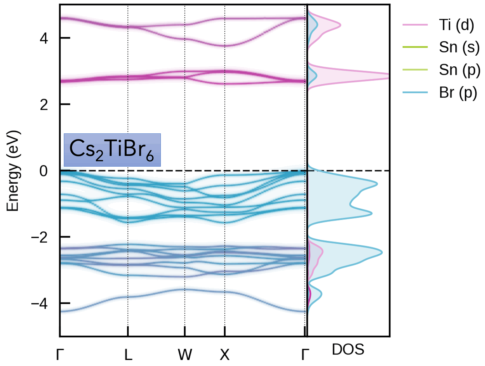
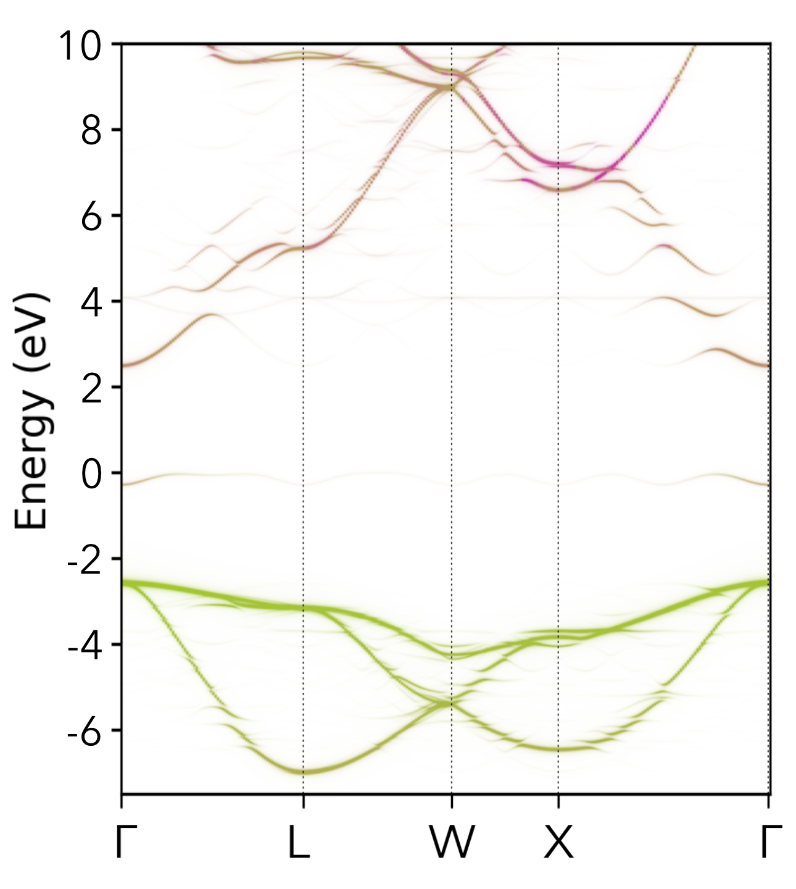

[](https://smtg-Bham.github.io/easyunfold/)
[](https://codecov.io/gh/SMTG-Bham/easyunfold)
[](https://pypi.org/project/easyunfold)
[](https://smtg-Bham.github.io/easyunfold/)
[](https://doi.org/10.21105/joss.05974)

[](https://smtg-Bham.github.io/easyunfold/)

`easyunfold` is intended for obtaining the effective band structure of a supercell for a certain _k_-point
path of the primitive cell. It was originally based on
[PyVaspwfc](https://github.com/QijingZheng/VaspBandUnfolding) for reading VASP wavefunction outputs,
with a notable improvement being that symmetry-breaking is properly accounted for by sampling necessary
additional _k_-points and averaging accordingly. Documentation site
[here](https://smtg-bham.github.io/easyunfold/)!

Our goal is to implement the band structure unfolding workflow in a robust and user-friendly software
package.
Typical applications of band structure unfolding are the electronic structure analysis of defects, disorder, alloys, surfaces (and more), as illustrated in the example outputs below and [docs examples](https://smtg-bham.github.io/easyunfold/examples.html).

For the methodology of supercell band unfolding, see
[here](https://link.aps.org/doi/10.1103/PhysRevB.85.085201).

### Example Outputs
[Cs₂(Sn/Ti)Br₆ Vacancy-Ordered Perovskite Alloys](https://doi.org/10.1021/acs.jpcc.3c05204) |     Oxygen Vacancy (*V*ₒ⁰) in MgO
:-------------------------:|:------------------------------------:
 | 

See the [`easyunfold` YouTube tutorial](https://youtu.be/9zeABbd1r1U?si=Oix3Bamiw8DZaMO4) for a quick overview of the theory of band structure unfolding, and a walkthrough of the calculation & analysis workflow with `easyunfold`.

## Usage

To generate an unfolded band structure, one typically needs to perform the following steps:

1. Create a primitive unit cell, and generate a band structure _k_-point path corresponding to this
   primitive cell.
2. Create a supercell (e.g. disordered, defective, surface slab etc.), and obtain its optimised structure.
3. Generate a series of _k_-points for the supercell to be calculated.
4. Perform a band structure calculation with the supercell, and save its wavefunction output to file.
5. Post-process the supercell wavefunction to obtain the unfolded band structure in the _k_-point path
   of the primitive unit cell.

These generation and analysis steps are automated in `easyunfold`, with only the primitive unit cell and
supercell structures required as inputs from the user.

Typically, the supercell comprises some form of symmetry-breaking relative to the primitive cell, such
as defects, disorder (e.g. special quasi-random structures (SQS) for site disorder – other forms of
disorder such as magnetic, dynamic/vibrational, polar, elastic etc. also possible), or a surface/interface
slab.
In all cases, the supercell symmetry is lowered compared to the pristine primitive cell.
Hence, for a given _k_-point path in the primitive cell Brillouin Zone, additional _k_-points are
required to be sampled for the supercell, and the extracted spectral weights need to be appropriately
averaged to obtain the correct effective band structure (EBS). See the docs
[Theory](https://smtg-bham.github.io/easyunfold/theory.html) page for more details.
<!-- when JOSS submitted, add link to paper (discussion of theory) here! -->
<!--- When JOSS submitted, add 'License and Citation' section here, and `CITATION.cff` file --->

Please see the [documentation](https://smtg-bham.github.io/easyunfold/) for guides and examples.

## Installation

### Install from `pip`

`easyunfold` can be installed from `pip`:

```
pip install easyunfold
```

This will also install the package dependencies, if any are missing.

After installation, running `easyunfold` on the command-line should give the following output:

```
Usage: easyunfold [OPTIONS] COMMAND [ARGS]...

  Tool for performing band unfolding

Options:
  --help  Show this message and exit.

Commands:
  generate  Generate the kpoints for sampling the supercell
  unfold    Perform unfolding and plotting
```

### Developer Installation (from source)

A recent version of `pip` is needed to do this, due to the new style of the `pyproject.toml` configuration
file.
To upgrade your `pip`, do:

```
pip install -U pip
```

Assuming the package is in the `easyunfold` folder, use the following command to install:

```
pip install "./easyunfold[test,doc,pre-commit]"
```

which also installs additional dependencies for building documentation (`doc`), running tests (`test`) and
dependencies for using pre-commit hooks (`pre-commit`).

## Citation

If you use `easyunfold` in your work, please cite:
- B. Zhu, S. R. Kavanagh & D. O. Scanlon, (2024). easyunfold: A Python package for unfolding electronic band structures. Journal of Open Source Software, 9(93), 5974, https://doi.org/10.21105/joss.05974

## Studies using `easyunfold`

We'll add papers that use `easyunfold` to this list as they come out!

- K. Eggestad, B. A. D. Williamson, D. Meier and S. M. Selbach **_Mobile Intrinsic Point Defects for Conductive Neutral Domain Walls in LiNbO<sub>3</sub>_** [_ChemRxiv_](https://chemrxiv.org/engage/chemrxiv/article-details/6687aa33c9c6a5c07a59a394) 2024
- L. Zhang et al. **_Study of native point defects in Al<sub>0.5</sub>Ga<sub>0.5</sub>N by first principles calculations_** [_Computational Materials Science_](https://doi.org/10.1016/j.commatsci.2024.113312) 2024
- S. M. Liga & S. R. Kavanagh, A. Walsh, D. O. Scanlon and G. Konstantatos **_Mixed-Cation Vacancy-Ordered Perovskites (Cs<sub>2</sub>Ti<sub>1–x</sub>Sn<sub>x</sub>X<sub>6</sub>; X = I or Br): Low-Temperature Miscibility, Additivity, and Tunable Stability_** [_Journal of Physical Chemistry C_](https://doi.org/10.1021/acs.jpcc.3c05204) 2023
- Y. T. Huang & S. R. Kavanagh et al. **_Strong absorption and ultrafast localisation in NaBiS<sub>2</sub> nanocrystals with slow charge-carrier recombination_** [_Nature Communications_](https://www.nature.com/articles/s41467-022-32669-3) 2022
- A. T. J. Nicolson et al. **_Interplay of Static and Dynamic Disorder in the Mixed-Metal Chalcohalide Sn<sub>2</sub>SbS<sub>2</sub>I<sub>3</sub>_** [_Journal of the Americal Chemical Society_](https://doi.org/10.1021/jacs.2c13336) 2023
- Y. Wang & S. R. Kavanagh et al. **_Cation disorder engineering yields AgBiS<sub>2</sub> nanocrystals with enhanced optical absorption for efficient ultrathin solar cells_** [_Nature Photonics_](https://www.nature.com/articles/s41566-021-00950-4) 2022 (early version)
<!-- Others? -->

## DFT code support

At the moment, easyunfold supports [VASP](https://www.vasp.at) and [CASTEP](http://www.castep.org), but most of the routines are abstracted from the code specific details.
In principle, support for other plane wave DFT code can be added by:

- Implementing a subclass of `WaveFunction` that handles reading the wave function output.
- Implementing functions for reading/writing _k_-points.
- Adding branches for dispatching based on the `dft_code` attribute of the `UnfoldKSet` object in
  various places within the code.

The Atomic Simulation Environment ([ASE](https://wiki.fysik.dtu.dk/ase/)) is used by `easyunfold` for
reading in structures, so structure file IO is natively supported for essentially all public DFT codes.

### Code Compatibility Notes
- Atom-projected band structures are currently only supported for `VASP` calculation outputs.
- Gamma-only and non-collinear spin calculations are not supported for `CASTEP`.

## Contributors
- [Bonan Zhu](https://github.com/zhubonan)
- [Seán Kavanagh](https://github.com/kavanase)
- [Adair Nicolson](https://github.com/adair-nicolson)

And those who helped in the development:
- [Joe Willis](https://github.com/joebesity)
- [David O. Scanlon](http://davidscanlon.com/?page_id=5)
