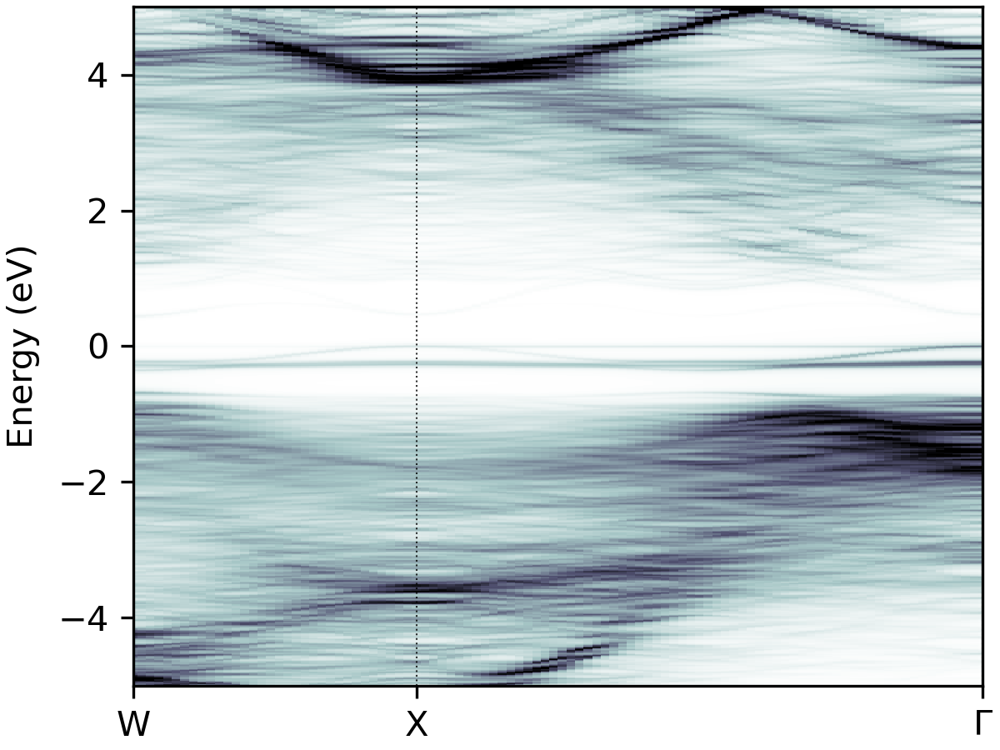

# Cation-Disordered NaBiS<sub>2</sub> with atomic projections

:::{note}
The files needed for reproducing this example are provided in the 
[examples/NaBiS2](https://github.com/SMTG-UCL/easyunfold/tree/main/examples/NaBiS2) folder. 
Note that the `PROCAR.gz` file will need to be decompressed with `gzip -d PROCAR.gz` if recalculating 
and reproducing these example plots.
:::

In this example, we unfold the bands from a 80-atom special-quasirandom (SQS) supercell of 
NaBiS<sub>2</sub>, where the Na and Bi cations are quasi-randomly distributed, in order to simulate 
randomised cation disorder in the material. 

:::{tip}
SQS supercells can be generated using tools like 
[icet](https://icet.materialsmodeling.org/moduleref_icet/tools.html#module-icet.tools.structure_generation)
or [ATAT](https://www.brown.edu/Departments/Engineering/Labs/avdw/atat/).
:::

These results were published in Y. T. Huang & S. R. Kavanagh et al. 2022 [^1], and an early version of `easyunfold` was 
used for the similar AgBiS$_2$ in Y. Wang & S. R. Kavanagh et al. 2022 [^2], with these plots demonstrating the key 
differences in electronic structure and thus photovoltaic performance between these two materials.

## Standard Unfolded Band Structure
We have previously calculated the `easyunfold.json` file from the calculation using `easyunfold calculate WAVECAR`. 
Using `easyunfold unfold plot --colour-norm 0.5`, we obtain the following unfolded band structure:

```{figure} ../../examples/NaBiS2/NaBiS2_unfold-plot.png
:alt: NaBiS2 unfolded band structure
:width: 400px
Unfolded band structure of $\ce{NaBiS2}$
```

### Visualisation Customisation: Colour map and intensity scaling
The band structure above is nice, but we can make the plot a little clearer by adjusting some of the parameters like 
the intensity scaling (via `--colour-norm`) and the colour map (via `--cmap`). Below we set `--colour-norm 0.4` to 
increase the colourmap intensity, and try `BuPu`, `viridis` and `bone_r` from left to right below: 

```bash
easyunfold unfold plot --colour-norm 0.4 --cmap "BuPu"
easyunfold unfold plot --colour-norm 0.4 --cmap "viridis"
easyunfold unfold plot --colour-norm 0.4 --cmap "bone_r"
```

BuPu             |  viridis        |  bone_r
:-------------------------:|:-------------------------:|:-------------------------:
  |   |  

## Atom-Projected Unfolded Band Structure
We can also plot the unfolded band structure with atomic projections, which is useful for understanding the electronic 
structure of the material. In this case, we are curious as to which atoms are contributing to the band edges, and so 
the atomic projections will be useful. For this, we need the `PROCAR` output from VASP with the atomic and orbital 
projection information, and so `LORBIT` should be set to `11`, `12`, `13` or `14` in the `INCAR` for the supercell 
calculation.

When plotting the unfolded band, the `plot-projections` subcommand is used with the `--procar <PROCAR>` and 
`--atoms` options:

```bash
easyunfold unfold plot-projections --atoms="Na,Bi,S" --colour-norm=0.5 --combined
```

```{figure} ../../examples/NaBiS2/NaBiS2_unfold-plot_proj.png
:alt: NaBiS2 atom-projected unfolded band structure
:width: 400px

Unfolded band structure of NaBiS<sub>2</sub> with atomic contributions.
```

From this plot, we can see that sulfur anions dominate the valence band, while bismuth cations dominate the conduction 
band, with minimal contributions from the sodium cations as expected.

:::{note}
The atomic projections are not stored in the `easyunfold.json` data file, so the `PROCAR` file should be 
kept for replotting in the future.
:::

While the main conclusions of S dominating the valence band and Bi dominating the conduction band are clear from the 
plot above, the high intensity of the S projections in the valence band makes the Bi contributions in the conduction 
band more faint and less apparent. 

So, we can create separated plots for each atom type to make their individual contributions more clear, by omitting the 
`--combined` tag:

```bash
easyunfold unfold plot-projections --atoms="Na,Bi,S" --cmap="bone_r" --colour-norm 0.5
```

```{figure} ../../examples/NaBiS2/NaBiS2_unfold-plot_proj_sep.png
:alt: NaBiS2 atom-projected separated unfolded band structure 
:width: 800px

Unfolded band structure of NaBiS<sub>2</sub> with atomic contributions plotted separately.
```

An alternative option here is also to just plot only the contributions of `Na` and `Bi` cations, with no S projections:
```bash
easyunfold unfold plot-projections --atoms="Na,Bi" --colour-norm=0.5 --combined
```

```{figure} ../../examples/NaBiS2/NaBiS2_unfold-plot_proj_noS.png
:alt: NaBiS2 atom-projected unfolded band structure, no S 
:width: 400px

Unfolded band structure of NaBiS<sub>2</sub> with atomic contributions of only Na and Bi.
```

While this plot isn't the most aesthetic, it clearly shows that Bi (green) contributes to both the conduction band and 
(less so) valence band states, but Na (red) doesn't contribute significantly at or near the band edges 
(it's a spectator ion!). 

## Unfolded Band Structure with Specific Atom Selection
In certain cases, we may want to project the contributions of specific atoms to the unfolded band structure, rather
than all atoms of a certain element. For example, in this example case of NaBiS$_2$, we see that a flat localised state 
is forming within the 'bulk' band gap. We can show that this state is contributed by only one or two atoms in the 
supercell, using the `--atoms-idx` option:
```bash
easyunfold unfold plot-projections -unfold plot-projections --atoms-idx="1-55,57-65,67-80|56,66" --colour-norm=0.5
```

```{figure} ../../examples/NaBiS2/NaBiS2_unfold-plot_proj_sep_atomsidx.png
:alt: NaBiS2 atom-projected unfolded band structure, specific atoms 
:width: 400px

Unfolded band structure of NaBiS<sub>2</sub> with the atomic contributions of atoms 56 and 66 plotted separately.
```
Here we can see that this in-gap localised state is dominated by only two (sulfur) atoms in the supercell (atoms `56` 
and `66`), which correspond to Na-rich pockets in NaBiS<sub>2</sub>, as discussed in Huang & Kavanagh et al. [^1].

:::{note}
The `--atoms-idx` option is used to specify the atoms to be projected onto the unfolded band structure. This takes a 
string of the form `a-b|c-d|e-f` where `a`, `b`, `c`, `d`, `e` and `f` are integers corresponding to the atom indices 
in the VASP structure file (i.e. `POSCAR`/`CONTCAR`, corresponding to the `PROCAR` being used to obtain the 
projections). Different groups are separated by `|`, and `-` can be used to define the range for each projected atom 
type. A comma-separated list can also be used instead of ranges with hyphens. Note that 1-based indexing is used for 
atoms, matching the convention in VASP, which is then converted to zero-based indexing internally in python. 
:::


[^1]: [Huang, YT., Kavanagh, S.R., Righetto, M. et al. Strong absorption and ultrafast localisation in NaBiS2 nanocrystals with slow charge-carrier recombination. Nat Commun 13, 4960 (2022)](https://www.nature.com/articles/s41467-022-32669-3) 
[^2]: [Wang, Y., Kavanagh, S.R., Burgués-Ceballos, I. et al. Cation disorder engineering yields AgBiS2 nanocrystals with enhanced optical absorption for efficient ultrathin solar cells. Nat. Photon. 16, 235–241 (2022).](https://www.nature.com/articles/s41566-021-00950-4)