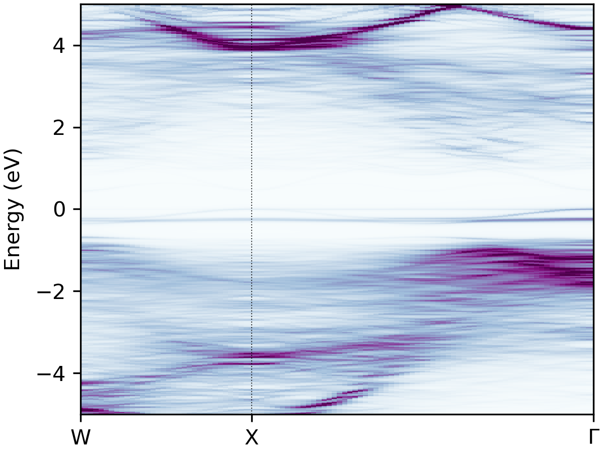
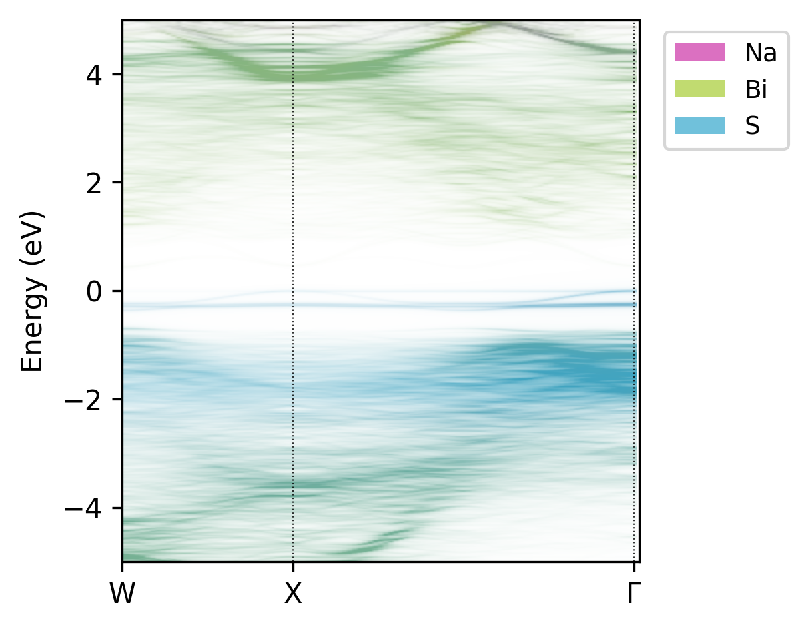

# Tutorial

The main goal of `easyunfold` is to make the band structure unfolding workflow easier to implement and 
less error-prone. To generate an unfolded band structure, one typically needs to perform the following 
steps:

1. Create a primitive unit cell, and generate a band structure _k_-point path corresponding to this 
   primitive cell.
2. Create a supercell (e.g. disordered, defective, surface slab etc.), and obtain its optimised structure.
3. Generate a series of _k_-points for the supercell to be calculated.
4. Perform a band structure calculation with the supercell, and save its wavefunction output to file.
5. Post-process the supercell wavefunction to obtain the unfolded band structure in the _k_-point path 
   of the primitive unit cell.

These generation and analysis steps are automated in `easyunfold`, with only the primitive unit cell and 
supercell structures required as inputs from the user.

Typically, the supercell comprises some form of symmetry-breaking relative to the primitive cell, such 
as defects, disorder (e.g. special quasi-random structures (SQS) for site disorder – other forms of 
disorder such as magnetic, dynamic/vibrational, polar, elastic etc. also possible), or a surface/interface 
slab.
In all cases, the supercell symmetry is lowered compared to the pristine primitive cell.
Hence, for a given _k_-point path in the primitive cell Brillouin Zone, additional _k_-points are 
required to be sampled for the supercell, and the extracted spectral weights need to be appropriately 
averaged to obtain the correct effective band structure (EBS). See the docs 
[Theory](https://smtg-ucl.github.io/easyunfold/theory.html) page for more details.

At the moment, two plane-wave DFT codes, VASP[^vasp] and CASTEP[^castep], are supported. In principle, 
support can be easily added for other plane-wave codes if the wavefunction can be read in.

Below is a guide for performing band structure unfolding when using VASP.

## Step 1 - Generate the _k_-point path for the primitive cell

In this step, we first generate the band structure _k_-point path we want to calculate. To do this, we use the prototype _high-symmetry primitive_ structure to get the corresponding _k_-point path. 

:::{note}
For disordered materials, this primitive cell should be the idealised primitive cell of the material (i.e. the primitive structure where all disordered sites have been set equal), not the SQS cell, and for defect supercells this should be the _primitive_ cell of the host compound, not the bulk supercell.
:::

This can be done by well-established packages such as 
[seekpath](https://www.materialscloud.org/work/tools/seekpath) or 
[sumo](https://github.com/SMTG-UCL/sumo).
Note that the "standardised" primitive cell may be different from your input structure,
and the generated path is correct for the standard primitive cell only.
We recommend using [sumo](https://github.com/SMTG-UCL/sumo) for generating the _k_-points, which provides 
a nice command line interface, and automatically informs you if your input structure is not the required 
'standardised' primitive cell:

```
sumo-kgen -p POSCAR
```

A `POSCAR_prim` file will be written out if `sumo` detects that the input structure is not the required 
'standardised' primitive cell. If this is the case, the `POSCAR_prim` file should be used for further 
supercell generation (or at least ensure that the supercell and the standardised primitive cell are 
commensurate, with matching lattice parameters between `POSCAR_prim` and that used for supercell 
generation).

The _k_-point path is written to `KPOINTS_band`.

:::{tip}
`sumo` can be installed with `pip`:

```bash
pip install sumo
```

:::

## Step 2 - Generate the _k_-point path for the supercell calculation

At this point, you should have your relaxed supercell structure (which likely has a lower symmetry than 
the pristine primitive unit cell).
For LDA/GGA DFT calculations, the set of _k_-points for the supercell band structure can be generated with:

```
easyunfold generate primitive/POSCAR supercell/POSCAR primitive/KPOINTS_band --matrix "2 2 2"
```

For hybrid DFT band structure calculations, the electronic minimisation must be conducted self-consistently 
(i.e. `ICHARG<10`) as discussed on the 
[VASPwiki](https://www.vasp.at/wiki/index.php/Band-structure_calculation_using_hybrid_functionals), and so in this case 
we need to provide an `IBZKPT` file (e.g. from a previous SCF calculation for the supercell structure) using the 
`--scf-kpoints` option, for which the _k_-points will be included with their original weights, and all band structure 
_k_-points included by `easyunfold` will then be added as zero-weighted _k_-points. For hybrid DFT calculations, it can
also be useful to split the _k_-points into multiple calculations to reduce the computational overhead and/or memory 
consumption, and this can be done with the `--nk-per-split` option, e.g.:

```
easyunfold generate primitive/POSCAR supercell/POSCAR primitive/KPOINTS_band --matrix "2 2 2" --nk-per-split 60 --scf-kpoints supercell/IBZKPT
```
This will generate files named as `KPOINTS_easyunfold_001`, `KPOINTS_easyunfold_002`, each containing 
60 zero-weighted _k_-points on top of the weighted SCF _k_-points.

See the help message with `easyunfold generate -h` for more details.
Note that the `--matrix` input is for setting the transformation matrix such that

```
cell_super = M @ cell_primitive
```

where `cell_super` and `cell_primitive` are (3,3) matrices made of **row vectors**.
If `M` is non-diagonal, all nine elements must be passed in a row-major order.

The `--matrix` argument may be omitted (and automatically detected by `easyunfol`) if the supercell is 
perfectly commensurate with the primitive cell, which is the case if the supercell calculation did not 
undergo cell relaxation (typically the case for defect calculations).

If cell relaxation did take place, it is important to note that the unfolded band structure does not 
correspond exactly to the Brillouin Zone of the original primitive cell, but to that of a primitive cell 
deformed in a similar way to the supercell relaxation.

An `easyunfold.json` file will be written which contains the information of the _k_-point unfolding 
calculation. The supercell _k_-points to be calculated are written to a file named `KPOINTS_easyunfold`.
It is possible to change the name `easyunfold` by passing an explicit tag with the `--out-file` option.


:::{tip}

Input files for CASTEP can be generated with option `--code castep`. 
In this case, the `<seed>.cell` file should be passed containing the primitive cell _k_-points that are
stored under the `spectral_kpoints_list` block.
The `cell` file of the supercell structure will be used as a template for generating a single `cell` 
file containing the supercell _k_-points stored under the `spectral_kpoints_list` block.
The choice of the DFT code is stored in the data file (`easyunfold.json`) and will be used 
automatically in later steps.

:::


## Step 3 - Perform the unfolding

At this point, a supercell calculation should be completed with a `WAVECAR` (containing the plane wave 
coefficients) written, containing all the _k_-points in the generated `KPOINTS_easyunfold` file.
This is typically a non-self-consistent calculation with `ICHARG=11` for standard (LDA/GGA) DFT, or a 
self-consistent calculation with zero-weighted _k_-points if hybrid functionals are used (see 
[VASPwiki](https://www.vasp.at/wiki/index.php/Band-structure_calculation_using_hybrid_functionals)).

To compute the spectral weights, we run the following command:

```
easyunfold unfold calculate WAVECAR
```

This command computes the spectral weights and save them to the `easyunfold.json` file.
You can load the `easyunfold.json` file to read the spectral weights manually, or proceed with the 
command line interface to generate a plot.

If the _k_-points have been split into multiple calculations (for example, for those involving hybrid 
functionals), all wave function files (e.g. `WAVECAR` for VASP) need to be passed:

```
easyunfold unfold calculate calc1/WAVECAR calc2/WAVECAR  # or 'calc*/WAVECAR' 
```

For large `WAVECAR`s, it may take some time to parse and compute the weights. Note you should use the `--gamma` and/or 
`--ncl` options if the calculation has $\Gamma$-only _k_-points or non-collinear spins (i.e. spin-orbit coupling), 
respectively.

:::{tip}

Wave functions (plane wave coefficients) in a CASTEP spectral calculation are stored in the `<seed>.
orbitals` file, and the `<seed>.check` file only contains the wave function for the self-consistent field 
calculation. Note that the former is not written by default, and needs to be turned on by setting:

```
write_orbitals : true
```

in the `<seed>.param` file.

:::

## Step 4 - Plot the results

Simply do:

```
easyunfold unfold plot
```

to generate a plot of the spectral function, giving an output like this:

```{figure} ../examples/NaBiS2/NaBiS2_unfold-plot.png
:alt: NaBiS2 unfolded band structure
:width: 400px
Unfolded band structure of $\ce{NaBiS2}$
```

It is possible to further customise the plot though command line arguments - see the help message with 
`easyunfold unfold plot --help`, with outputs like:

BuPu `cmap`        |                     viridis `cmap`                      |  atom-projected
:-------------------------:|:-------------------------------------------------------:|:-------------------------:
  |   |  

:::{tip}
Figure can be further customised by passing a path to a matplotlib style sheet file, for example:

```
easyunfold unfold --mpl-style-file <path-to-mpl-style-sheet> plot
```

which can be used to change the font, font sizes, ticks styles etc.
Read more on [the matplotlib tutorial page](https://matplotlib.org/stable/tutorials/introductory/customizing.html#using-style-sheets).
:::

[^vasp]: https://www.vasp.at
[^castep]: http://www.castep.org