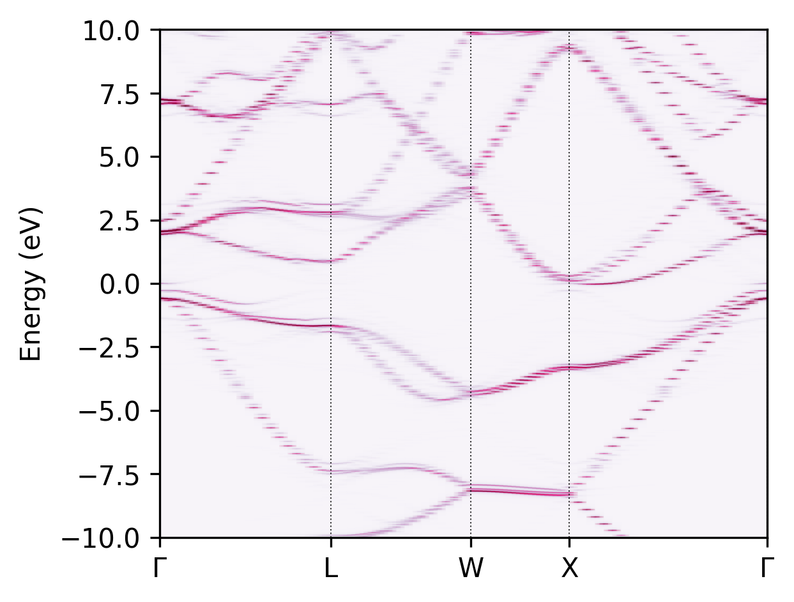

## Unfolding 2x2x2 Si supercell with a displaced atom

First, generate the supercell kpoints:

```
easyunfold generate Si/POSCAR Si_super_deformed/POSCAR Si/KPOINTS_band
```

Copy the kpoints to the supercell calculation folder:

```
cp KPOINTS_easyunfold Si_supercell_deformed
```

Ensure a SCF kpoints is used and run the supercell calculation, make sure `ICHARG=11` is commented out in the INCAR:

```
cd Si_supercell_deformed
cp KPOINTS_scf KPOINTS
sed -i `s/.*ICHARG=11/!ICHARG=11/g` INCAR
mpirun -np 12 vasp_std 
```

Now run the band structure calculation with `ICHARG=11`

```
sed -i `s/.*ICHARG=11/ICHARG=11/g` INCAR
cp KPOINTS_easyunfold KPOINTS
mpirun -np 12 vasp_std 
```

Calculate the weights and record the VBM:

```
cd ../
easyunfold unfold calculate Si_super_deformed/WAVECAR --vasprun Si_super_deformed/vasprun.xml
```

NOTE: If you don't wnat to run the VASP calculation by yourself, the calculated `WAVECAR` and `vasprun.xml` for this example with:

```
wget -o Si_super_deformed/WAVECAR https://www.dropbox.com/s/3cmn2epw7d290jd/WAVECAR?dl=1
wget -o Si_super_deformed/vasprun.xml https://www.dropbox.com/s/ota78qqdvxsehmi/vasprun.xml?dl=1
```

Generate the graph:

```
easyunfold unfold plot
```


Output:



Band structure of the primitive cell:

