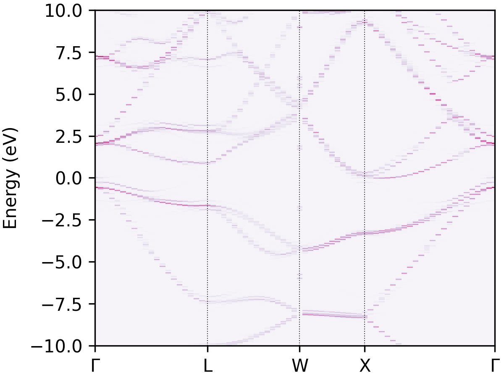

# Summary

The electronic band structure is an important quantity to obtain for
understanding and designing solid crystalline materials in many fields
such as photovoltaic, catalysis, thermoelectric materials and transparent conducting
materials. Obtaining the band structure for a given crystal through first-principles
density functional theory calculation is a well-established routine operation.
However, the materials of interest are often complex and the simulation cells may contain multiple  primitive
cells of the archetypical structure.
For example, when modelling materials that exhibit site-occupation disordering, and/or investigating the effect of point defects.
While constructing supercells in the real space is straight forward, the resulting folded band structures can be very complicated, making them difficult
to analyse or interpret, as illustrated by Figure \autoref{fig:figure1}.
Band structure unfolding facilitates mapping the electronic structure
back to that of the primitive cell, thereby enabling the researchers to understand
structure-property relationships and compare the effect of various crystal
imperfections on an equal footing.

{width=100mm}

# Statement of need

There are existing packages that provide similar band structure unfolding capabilities, such as `BandUp`
[@bandup], and `VaspBandUnfolding` [@vaspbandunfolding].
`easyunfold` is written in Python with a focus of easy-to-use, data provenance and reproducibility.
It also includes plotting functionalities and can generate publication-ready figures.
An example outputs of the effective band structure produced is shown in Figure \autoref{fig:figure2} for a $2\times2\times2$ supercell of Si with a displaced Si atom.
A key feature of `easyunfold` is to provide data serialization complying the FAIR principle [@wilkinson:2016].
Both the input settings and calculated spectral weights are stored as a single JSON file.
This enables the unfolded band structure to be re-plotted and further analysed without reprocessing the wave function data.
In addition, multi-file wave function support allows DFT calculations to be performed in a flexible way,
which is essential for improving parallel efficiency using resource-hungry hybrid functional.

We chose Python as the programming language due to its low entry-barrier, flexibility and popularity in the materials modelling field.
An object-oriented approach is used when designing the package to allow abstractions when reading and process wave function data.
The code current supports two DFT codes, VASP and CASTEP, and others can be added with a small amount of coding effort.
`easyunfold` depends on common scientific computing packages such as `numpy` [@numpy] and `matplotlib` [@matplotlib].
The Atomic Simulation Environment (`ase`) [@ase] is used for reading input crystal structures from a wide range of formats.

`easyunfold` is designed for researchers with or without prior knowledge of Python.
A command-line interface is provided as the primary way of using the package.
Although power users may want to utilise the Python
API directly for advanced analysis and integration with workflow engines such as `AiiDA` [@huber:2020] and `atomate` [@mathew:2017].
`easyunfold` has been used in several scientific publications [@nicolson:2023; @wang:2022; @huang:2022] and graduate student research projects.

The combination of easy of use, flexibility, and efficiency will improve the accessibility of
band structure unfolding technique for materials modelling and help training new researchers.

{width=100mm}

# Theory

The mathematics of band structure unfolding has been discussed in detail in the work of @Popescu:2009.
Here, we only give a brief summary of the key ingredients.

Our goal is to reconstruct the energy of the Kohn-Sham states in reciprocal lattice of the primitive cell ($E(\vec{k})$), given a more complex (folded) $E(\vec{K})$ of the supercell.

Each $\vec{k}$ point in the primitive cell's first Brillouin zone can be mapped to a $\vec{K}$ in that of the supercell:

$$
\vec{K} = \vec{k} - \vec{G}_0.
$$

with $\vec{G}_0$ been a reciprocal lattice vector of the supercell.
Conversely, each $\vec{K}$ in the supercell can be unfolded into a set of $\vec{k}_i$:

$$
\vec{k}_i = \vec{K} + \vec{G}_i, i=1,...,N
$$

Importantly, for a given $\vec{k}$, there is a unique $\vec{K}$ that it folds to, as the first equation can be seem as to *wrap* the $\vec{k}$ back to the reciprocal unit cell of the supercell.
On the other hand, a single $\vec{K}$ may map to multiple $\vec{k}_i$s, as the Brillouin zone of the primitive cell includes that of the supercell.

To establish the relationship between $E(\vec{k})$ and $E(\vec{K})$, one can project  $\langle \vec{K}m|$, where $m$ labels the band, on a set of primitive cell Bloch states $\langle \vec{k}_i|$ and compute the spectral weight:

$$
P_{\vec{K}m}(\vec{k}_i) = \sum_n |\langle \vec{K}m |\vec{k}_i n \rangle |^2.
$$

where $P$ represents the probability of finding a set of primitive cell states $\langle \vec{k}_in$ contributing to the supercell state $\langle \vec{K}m |$,
or the amount of Bloch character $\vec{k}_i$ preserved in $\langle \vec{K}m \rangle$ at the same energy.

A more interpretable representation of the effective band structure is the spectral function, defined as:

$$
A(\vec{k}_i, E) = \sum_m P_{\vec{K}m}(\vec{k}_i)\delta(E_m - E).
$$

In practice, the $\delta$ function is replaced with a Gaussian or Lorentzian function which smear the contribution with discretised $E$.

For a plane wave basis, the $P_{\vec{K}}m(\vec{k}_i)$ can be calculated as (equation 15 @Popescu:2009):

$$
P_{\vec{K}m}(\vec{k}_i) = \sum_{\vec{g}} |C_{\vec{Km}}(\vec{g} + \vec{G}_i)|^2,
$$

where $\vec{g}$ are the reciprocal lattice vectors of the primitive cell.
Since the supercell lattice is commensurate with that of the primitive cell,
the plane wave coefficient to be summed, $C_{\vec{Km}}(\vec{g} + \vec{G_i})$, are included in the basis set of the supercell.
This means that a single supercell calculation producing the wave function (plane wave coefficients) at each $\vec{K}$ requested is sufficient for reconstructing the unfolded band structure.

The path of $\vec{k}$ in the primitive cell is often constructed with its symmetry in mind, and each $\vec{k}$ along the path can be mapped to multiple equivalent $\vec{k_s}$ points given the symmetry of the reference structure.
However, these $\vec{k}_s$ points may no longer be equivalent if supercell has broken  symmetry.

This can be addressed by first expanding each $\vec{k}$ based on the symmetry operations of the primitive cell, followed by a reduction using the symmetry of the supercell.
The spectral weight at each $\vec{k}$ is then a weighted combination of that from a set of $\vec{k}_s^\prime$ points that are inequivalent under the symmetry of the supercell.

# Acknowledgements

We acknowledge bug fixes from Adair Nicolson and help from these people testing the code and providing feedback: Joe Willis and Sabrine Hachmioune.

# References
