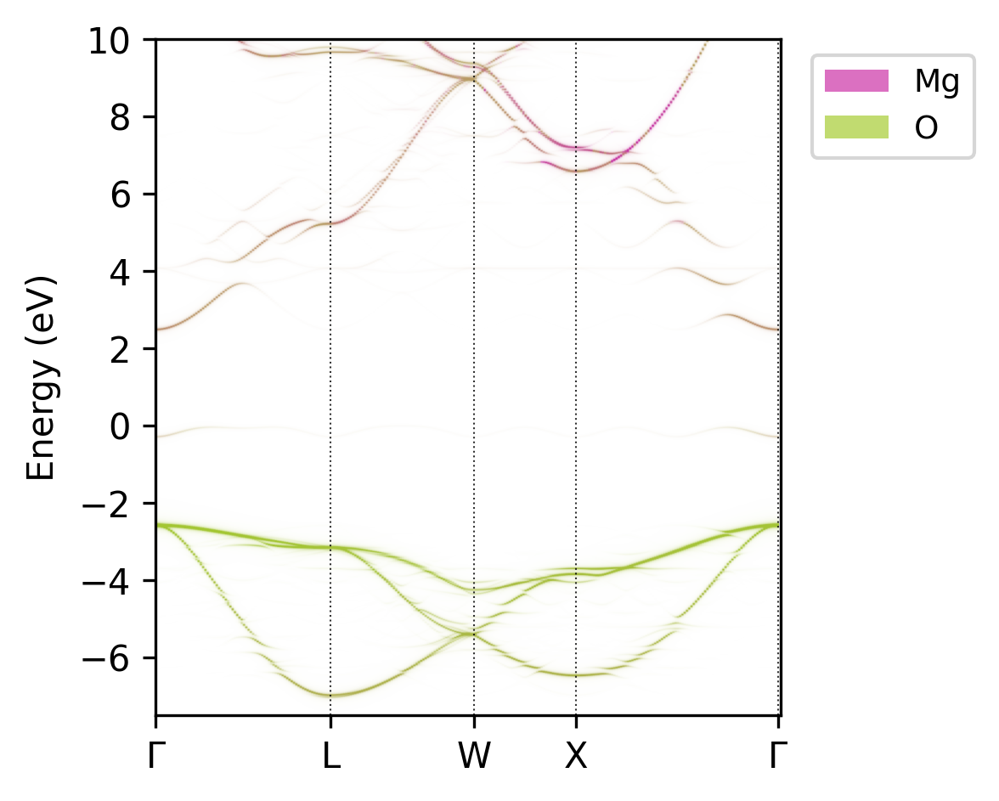

# Summary

The electronic band structure is an important property for
understanding and designing solid crystalline materials in many fields
such as photovoltaic, catalytic, thermoelectric and transparent-conducting
materials. Obtaining the band structure for an ideal crystal through first-principles
density functional theory (DFT) calculations is a well-established routine operation[@Ganose_2018].
However, the materials of interest are often complex and the simulation cells may contain multiple primitive
cells of the archetypal structure when, for example, modelling disordered or defective materials[@Kim_2020].
Repeating the unit cell in real space results in folded band structures, as illustrated in \autoref{fig:figure1}, complicating its interpretation and analysis.
Band structure unfolding maps the electronic structure from supercell calculations back to the reciprocal lattice of the primitive cell,
thereby enabling researchers to understand structure-property relationships and compare the effect of various crystal imperfections on an equal footing.
With `easyunfold`, we provide a simple, easy-to-use, yet powerful and flexible tool which implements the band structure unfolding workflow using plane-wave DFT codes, from input file generation to publication-quality plotting.

{width=100mm}

# Statement of need

There are existing packages that provide band structure unfolding capabilities, such as `BandUp`
[@bandup], and `VaspBandUnfolding` [@vaspbandunfolding].
`easyunfold` is written in Python with a focus on user-friendliness, data provenance, reproducibility, and publication-quality figure generation.
An example output of the effective band structure produced is shown in \autoref{fig:figure2} for a $2\times2\times2$ $\mathrm{MgO}$ supercell containing a neutral oxygen vacancy.
\autoref{fig:figure3} shows the orbital-projected effective band structure of a $\mathrm{Cs_2(Sn_{0.5},Ti_{0.5})Br_6}$ vacancy-ordered perovskite alloy [@kavanagh_frenkel_2022; @liga_mixed-cation_2023], in the Brillouin zone of the primitive $Fm\bar{3}m$ unit cell.
A key feature of `easyunfold` is to provide data serialization compliant with the FAIR principles [@wilkinson:2016].
Both the input settings and calculated outputs are stored in a single JSON file.
This enables the unfolded band structure to be re-plotted and further analysed without reprocessing the wave function data, which can be time-consuming and require large storage space.

The package is designed with flexibility in mind.
`easyunfold` can split a supercell calculation into multiple runs.
This functionality is essential for compute-heavy and memory-intensive hybrid functional calculations, particularly if spin-orbit coupling is used, where the required computational resources would quickly become intractable otherwise.
Upon completion of all calculations, their wave functions can be collected to generate a single effective band structure.
The atomic and orbital projections can be used to colour the effective band structure (\autoref{fig:figure2}), and the electronic density of states (DOS) can optionally be plotted alongside (\autoref{fig:figure3}), which can provide valuable information for analysing the underlying structure-property relationships.

We chose Python as the programming language due to its low barrier-to-entry, flexibility and popularity in the materials modelling field.
An object-oriented approach is used when designing the package to allow abstractions when reading and processing wave function data.
The code currently supports two of the most popular DFT codes, VASP [@vasp1;@vasp2] and CASTEP [@castep], and others can be added with a small amount of coding effort.
`easyunfold` depends on common scientific computing packages such as `numpy` [@numpy] and `matplotlib` [@matplotlib].
The Atomic Simulation Environment (`ase`) [@ase] is used for reading input crystal structures from a wide range of formats.

`easyunfold` is designed for researchers with or without prior knowledge of Python.
A command-line interface is provided as the primary way of using the package.
Thanks to the Python API, `easyunfold` can be easily integrated with workflow engines such as `AiiDA` [@huber:2020] and `atomate` [@mathew:2017]
as well as disorder/defect modelling codes such as `icet` [@icet] and `doped` [@doped].
`easyunfold` has been used in several scientific publications [@nicolson:2023; @wang:2022; @huang:2022] and graduate student research projects.

The combination of user-friendliness, flexibility, and efficiency will improve the accessibility of
band structure unfolding and help train new researchers.

{width=130mm}

![Orbital-projected effective band structure of a disordered $\mathrm{Cs_2(Sn,Ti)Br_6}$ vacancy-ordered perovskite alloy [@kavanagh_frenkel_2022; @liga_mixed-cation_2023]. \label{fig:figure3}](Cs2SnTiBr6.png){width=130mm}

# Theory

The mathematics of band structure unfolding has been discussed in detail in the work of [@Popescu:2009].
Here, we only give a brief summary of the key ingredients.

Our goal is to reconstruct the energies of the Kohn-Sham states in the reciprocal lattice of the primitive cell ($E(\vec{k})$), given a more complex (folded) $E(\vec{K})$ of the supercell.

Each $\vec{k}$-point in the primitive cell's first Brillouin zone can be mapped to a $\vec{K}$ in that of the supercell:

$$
\vec{K} = \vec{k} - \vec{G}_0.
$$

with $\vec{G}_0$ being a reciprocal lattice vector of the supercell.
Conversely, each $\vec{K}$ in the supercell can be unfolded into a set of $\vec{k}_i$:

$$
\vec{k}_i = \vec{K} + \vec{G}_i,\ \  i=1,...,N
$$

where $\vec{k}_i$ is a set of $N$ $\vec{k}$-points in the Brillouin zone of the primitive cell,
with $N$ equalling the number of primitive cells that the supercell includes in real space.
For a given $\vec{k}$, there is a unique $\vec{K}$ that it folds to, as the first equation can be seen as to *wrap* the $\vec{k}$ into the smaller reciprocal unit cell of the supercell.
On the other hand, a single $\vec{K}$ may map to multiple $\vec{k}_i$s,
as different $\vec{k}$-points in the Brillouin zone of the primitive cell (\autoref{fig:figure1}c) can fold onto the same point in that of the supercell (\autoref{fig:figure1}d).

To establish the relationship between $E(\vec{k})$ and $E(\vec{K})$, one can project  $\langle \vec{K}m|$, where $m$ labels the band, on a set of primitive cell Bloch states $\langle \vec{k}_i|$ and compute the spectral weight:

$$
P_{\vec{K}m}(\vec{k}_i) = \sum_n |\langle \vec{K}m |\vec{k}_i n \rangle |^2.
$$

where $P$ represents the probability of finding a set of primitive cell states $\langle \vec{k}_in$ contributing to the supercell state $\langle \vec{K}m |$,
or the amount of Bloch character $\vec{k}_i$ preserved in $\langle \vec{K}m |$ at the same energy.

Presenting the spectral weights directly in two-dimensional plots can be problematic due to the existence of states ($m$) with degenerate or closely-spaced energies.
A more interpretable representation of the effective band structure is the spectral function, defined as:

$$
A(\vec{k}_i, E) = \sum_m P_{\vec{K}m}(\vec{k}_i)\delta(E_m - E).
$$

where $A$ is the total intensity summed from all contributing $P_{\vec{K}m}$ at $\vec{k}_i$ and energy $E$.
In practice, the $\delta$ function is replaced with a Gaussian or Lorentzian function which smears the contribution across a discretised energy grid.

For a plane wave basis, the $P_{\vec{K}m}(\vec{k}_i)$ can be calculated as (equation 15 [@Popescu:2009]):

$$
P_{\vec{K}m}(\vec{k}_i) = \sum_{\vec{g}} |C_{\vec{Km}}(\vec{g} + \vec{G}_i)|^2,
$$

where $\vec{g}$ are the reciprocal lattice vectors of the primitive cell, and $C_{\vec{Km}}$ is the plane wave coefficient.
Since the supercell lattice is commensurate with that of the primitive cell,
the plane wave coefficients to be summed, $C_{\vec{Km}}(\vec{g} + \vec{G_i})$, are included in the basis set of the supercell.
This means that a single supercell calculation producing the wave function (plane wave coefficients) at each $\vec{K}$ required is sufficient for reconstructing the unfolded band structure.

The path of $\vec{k}$ in the primitive cell is often constructed with its symmetry in mind, and each $\vec{k}$ along the path can be mapped to multiple equivalent $\vec{k_s}$ points given the symmetry of the reference structure.
However, these $\vec{k}_s$ points may no longer be equivalent if the supercell has broken symmetry – which is almost always the case when performing band structure unfolding.
This can be addressed by first expanding each $\vec{k}$ based on the symmetry operations of the primitive cell, followed by a reduction using the symmetry of the supercell.
The spectral weight at each $\vec{k}$ is then a weighted combination of that from a set of $\vec{k}_s^\prime$ points that are inequivalent under the symmetry of the supercell.

# Acknowledgements

We acknowledge bug fixes from Adair Nicolson and help from Joe Willis and Sabrine Hachmioune in testing the code and providing feedback.

# References
